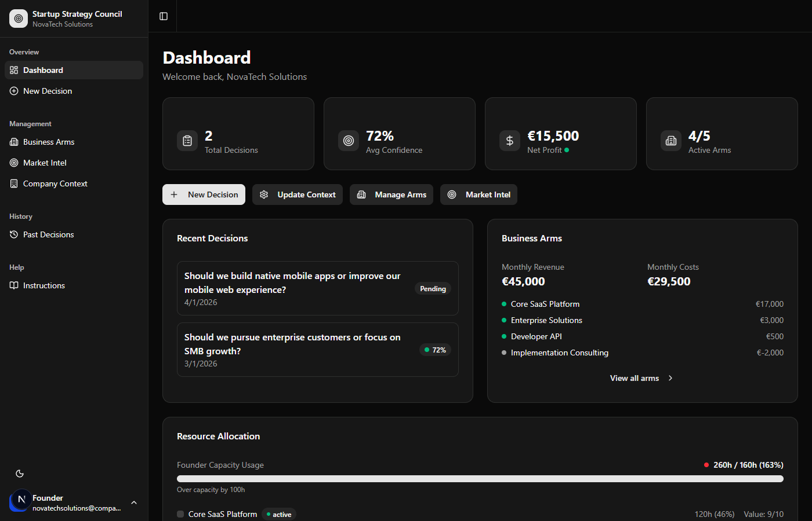
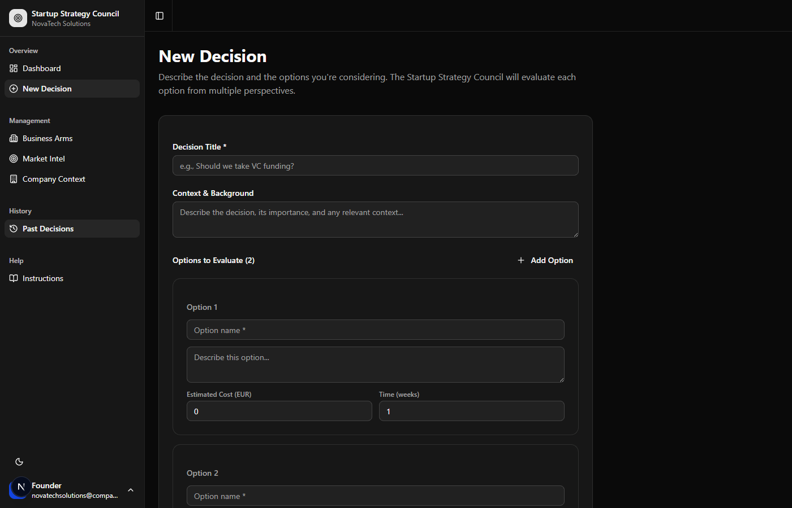
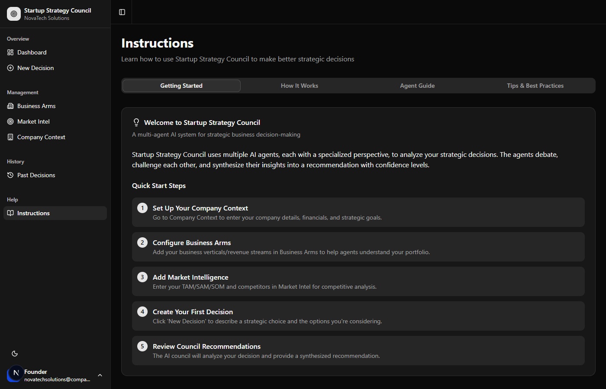

# Startup Strategy Council

[](LICENSE)
[](https://nextjs.org/)
[](https://www.typescriptlang.org/)
[](https://tailwindcss.com/)

> **Multi-agent AI strategic decision system for startups.** Get recommendations from 6 specialized AI agents that debate, challenge each other, and synthesize insights with confidence levels.



## ✨ Features

- **🤖 Multi-Agent Analysis** - 6 specialized AI agents evaluate each decision from different perspectives
- **💬 Agent Deliberation** - Agents with significantly different scores debate and challenge each other's positions
- **📊 Confidence Scoring** - Recommendations include confidence levels based on agent consensus
- **🏢 Company Context** - Store your company's financials, strategic goals, and constraints
- **📈 Business Arms Tracking** - Monitor revenue streams, costs, and time investment across business verticals
- **🎯 Market Intelligence** - Track competitors, market size (TAM/SAM/SOM), and trends
- **📜 Decision History** - Review past decisions and track outcomes

## 🤖 The Council: 6 Specialized Agents

| Agent | Focus Area | What They Analyze |
|-------|------------|-------------------|
| 💰 **Financial Analyst** | ROI & Cash Flow | Payback periods, expected value, financial risk |
| 📊 **Market Analyst** | Market Dynamics | TAM/SAM/SOM, competitive positioning, market timing |
| ⚠️ **Risk Analyst** | Risk Assessment | Execution, market, technical, and financial risks |
| 🎮 **Game Theorist** | Strategic Dynamics | Nash equilibrium, first-mover advantage, network effects |
| ⏰ **Resource Allocation** | Resource Management | Time investment, bottlenecks, delegation opportunities |
| 👔 **Chief of Staff** | Synthesis | Consensus building, dissent tracking, final recommendation |



## 🚀 Quick Start

### Prerequisites

- Node.js 18+
- [Claude CLI](https://github.com/anthropics/claude-code) installed and authenticated (recommended)
- OpenAI API key *(optional alternative to Claude CLI)*

### Installation

```bash
# Clone the repository
git clone https://github.com/kevincollinsirl/startup-strategy-council.git
cd startup-strategy-council

# Install dependencies
npm install

# (Optional) Set up OpenAI if not using Claude CLI
cp .env.example .env.local
# Edit .env.local with your OpenAI API key

# Start the development server
npm run dev
```

Open [http://localhost:3000](http://localhost:3000) in your browser.

### First Launch

On first launch, an onboarding wizard will guide you through:
1. **Company Details** - Name, team size, strategic goals
2. **Financials** - Monthly revenue, burn rate, key assets & constraints
3. **Business Arms** - Your revenue streams and business verticals
4. **Market Data** - TAM/SAM/SOM, competitors, market trends
5. **AI Provider** - Choose between Claude CLI or OpenAI

You can skip onboarding and configure everything later in Settings.

## 📖 How It Works



1. **Create a Decision** - Describe your strategic choice and add 2-4 options with estimated costs and timelines

2. **Run the Council** - Each of the 6 agents independently evaluates all options based on your company context

3. **Agent Deliberation** - Agents with significantly different scores (3+ points) debate their positions. A Chief of Staff moderates and resolves disputes.

4. **Get Recommendations** - The council synthesizes all perspectives into:
   - A recommended option
   - Confidence level (based on agent consensus)
   - Key reasoning from each agent
   - Dissenting opinions (if any)

5. **Review & Decide** - Use the council's analysis to inform your decision. Track outcomes over time.

## 🔧 AI Provider Options

### Claude CLI (Recommended)
Uses the Claude Code CLI for AI inference. Requires Claude CLI to be installed and authenticated.

```bash
# Install Claude CLI
npm install -g @anthropic-ai/claude-code

# Authenticate
claude auth login
```

### OpenAI API (Optional)
Alternative to Claude CLI. Uses OpenAI GPT models.

1. Get an API key from [OpenAI](https://platform.openai.com/api-keys)
2. Add to `.env.local`: `OPENAI_API_KEY=sk-...`
3. Or configure in Settings after launching

Supported models: GPT-4o (recommended), GPT-4 Turbo, GPT-4, GPT-3.5 Turbo

## 🛠️ Tech Stack

- **Framework**: [Next.js 15](https://nextjs.org/) (App Router)
- **UI Components**: [shadcn/ui](https://ui.shadcn.com/)
- **Styling**: [Tailwind CSS](https://tailwindcss.com/)
- **AI**: Claude CLI or OpenAI API
- **Storage**: File-based JSON (data/ directory)
- **Language**: TypeScript

## 📁 Project Structure

```
startup-strategy-council/
├── app/                    # Next.js App Router pages
│   ├── api/               # API routes
│   ├── arms/              # Business arms management
│   ├── context/           # Company context editor
│   ├── decisions/         # Decision pages (new, detail, history)
│   ├── instructions/      # Help documentation
│   ├── market/            # Market intelligence
│   └── settings/          # AI provider settings
├── components/            # React components
│   ├── ui/               # shadcn/ui components
│   └── ...               # App-specific components
├── data/                  # JSON data storage
├── lib/                   # Utilities and business logic
│   ├── agents/           # AI agent implementations
│   ├── ai-client.ts      # Unified AI interface
│   ├── claude-cli.ts     # Claude CLI wrapper
│   ├── openai-client.ts  # OpenAI client
│   ├── storage.ts        # Data persistence
│   └── types.ts          # TypeScript types
└── public/               # Static assets
```

## 🤝 Contributing

Contributions are welcome! Please see [CONTRIBUTING.md](CONTRIBUTING.md) for guidelines.

1. Fork the repository
2. Create a feature branch (`git checkout -b feature/amazing-feature`)
3. Commit your changes (`git commit -m 'Add amazing feature'`)
4. Push to the branch (`git push origin feature/amazing-feature`)
5. Open a Pull Request

## 📄 License

This project is licensed under the **Apache License 2.0** - see the [LICENSE](LICENSE) file for details.

### Attribution Requirement

If you use this software, please include attribution to Echofold with a link to [https://echofold.ai](https://echofold.ai) in your documentation or application credits. See [NOTICE](NOTICE) for details.

Example: *"Built with Startup Strategy Council by [Echofold](https://echofold.ai)"*

## 🙏 Acknowledgments

- Built with [Next.js](https://nextjs.org/) and [shadcn/ui](https://ui.shadcn.com/)
- AI powered by [Claude](https://anthropic.com/) and [OpenAI](https://openai.com/)
- Icons by [Lucide](https://lucide.dev/)

---

<p align="center">
  <strong>Built by <a href="https://echofold.ai">Echofold</a></strong><br>
  AI-powered business solutions
</p>
